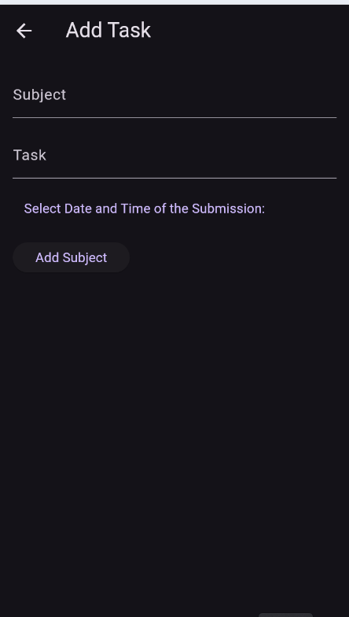
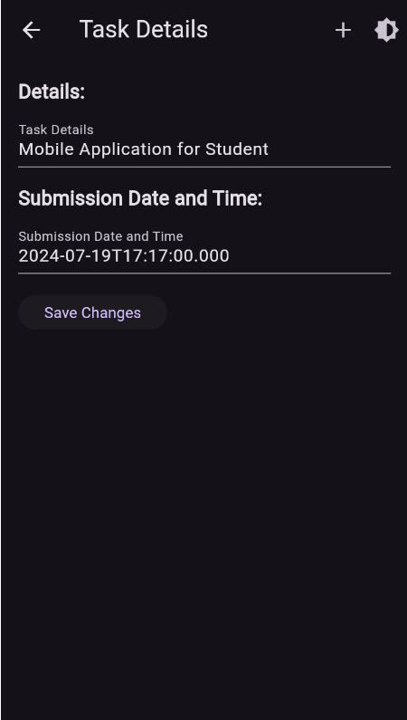

# Project In Application Development

**Crampanion Brainy Student Task Tamer**  
BSIT-3307

  The Crampanion Brainy Task Tamer is an mobile appplication that is designed specifically for students.It  
  is a mobile application that helps manage and organize their tasks, assignments, and deadlines effectively 
  by allowing them to create, edit, and delete tasks to set reminders. The main purpose and objective of this 
  mobile application is to assist students in managing their tasks and deadlines that they need to accomplish.

  

Functionalities

- Create and Add a Student Task
- Edit a Student Task
- Read or View the Student Task
- Delete a Student Task 

  
UI
 

                                               
  <pre>                                                  <b>Task Screen UI</b>        </pre>
  
                                               
<pre>                  <b>UI for Adding a Task</b>                                         <b>UI of Task Details</b>    </pre>

Developer

   <h5>&nbsp;&nbsp;&nbsp;&nbsp;&nbsp;&nbsp;&nbsp;&nbsp;&nbsp;&nbsp;&nbsp;&nbsp;&nbsp;&nbsp;&nbsp;&nbsp;&nbsp;&nbsp;&nbsp;&nbsp;&nbsp;&nbsp;&nbsp;&nbsp;&nbsp;&nbsp;Hawak Carl Jonel V. </h5>

      
        
    
    <h5>Lagunsing John Carlo M. </h5>
        
      
        
  
    <h5>Luna Andrei B.</h5>
       
      
        
   

Programming Languages used and Frameworks
 
&nbsp;&nbsp;&nbsp;&nbsp;&nbsp;&nbsp;
&nbsp;&nbsp;

</details

